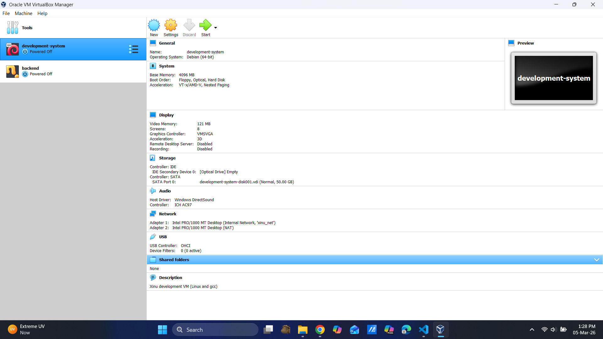
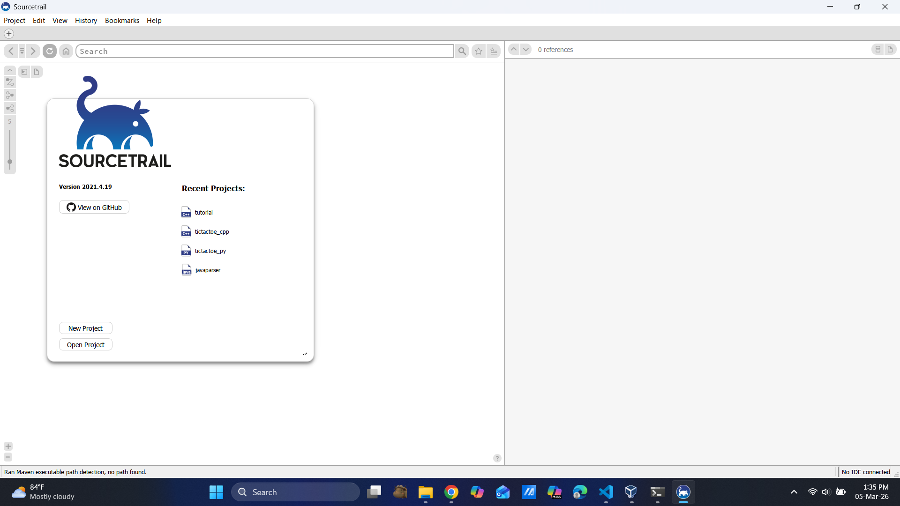

# <h1 align="center">Laporan Praktikum Modul I   Running Modul</h1>

Viona Aziz Syahputri - 2311104008

## Dasar Teori
Pada Running Modul dijelaskan tentang bagaimana Praktikum Sistem Operasi akan berjalan dengan menginstall beberapa tools yang dibutuhkan seperti VirtualBox untuk menjalankan mesin virtual, Ubuntu sebagai sistem operasi yang digunakan di dalam virtual machine, Xinu OS yang nantinya akan dipelajari pada modul berikutnya, serta Sourcetrail yang digunakan untuk membantu melihat dan memahami struktur kode program. VirtualBox sendiri merupakan aplikasi virtualisasi yang memungkinkan aku menjalankan sistem operasi lain di dalam komputer tanpa harus menginstallnya langsung pada perangkat utama. Dengan adanya virtual machine ini, proses pembelajaran sistem operasi bisa dilakukan dengan lebih aman karena tidak mempengaruhi sistem utama yang ada di komputer.

Selain itu, Ubuntu digunakan sebagai sistem operasi berbasis Linux yang akan dipakai selama praktikum untuk menjalankan berbagai proses dan percobaan yang berkaitan dengan sistem operasi. Xinu OS merupakan sistem operasi sederhana yang sering digunakan untuk tujuan pembelajaran agar aku bisa memahami konsep dasar sistem operasi seperti proses, memori, dan manajemen sistem secara lebih jelas. Sedangkan Sourcetrail digunakan untuk membantu melihat struktur dan hubungan antar kode program sehingga lebih mudah memahami alur program yang ada. Setelah semua tools tersebut diinstall, kemudian aku mencoba menjalankan VirtualBox untuk memastikan bahwa aplikasi tersebut sudah dapat berjalan dengan baik dan siap digunakan pada praktikum selanjutnya.

## Guided

## Referensi
1. [https://blog.rumahweb.com/virtualbox-adalah/](https://blog.rumahweb.com/virtualbox-adalah/)
2. [https://medium.com/@moch.andyyusuf.h.e.p/memuat-xinu-di-virtualbox-a-step-by-step-guide-9929e776c35b](https://medium.com/@moch.andyyusuf.h.e.p/memuat-xinu-di-virtualbox-a-step-by-step-guide-9929e776c35b)