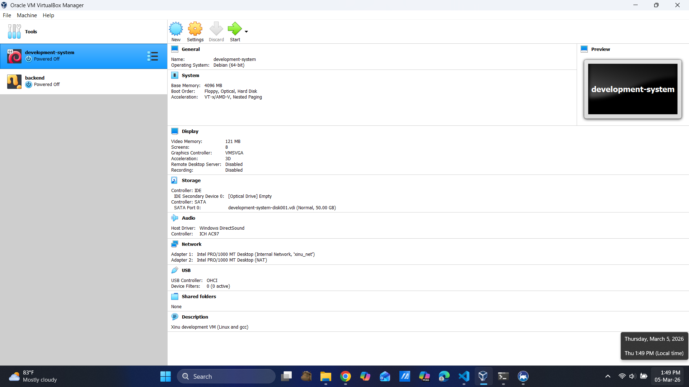
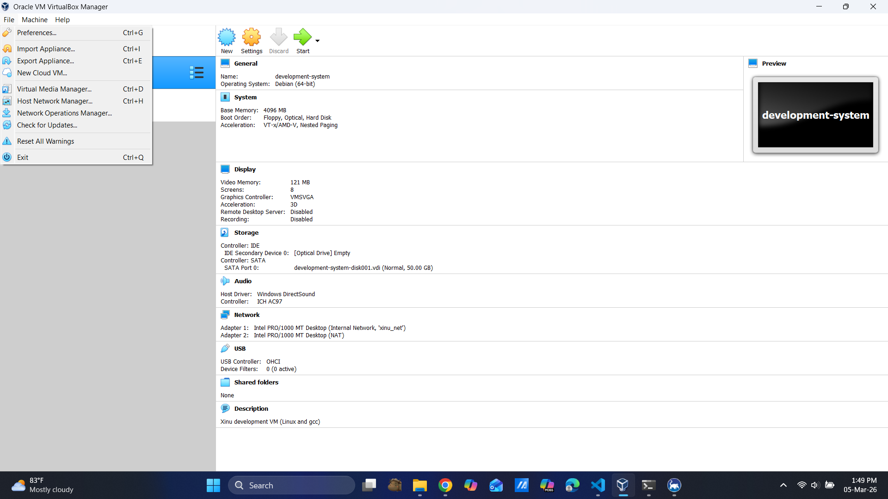
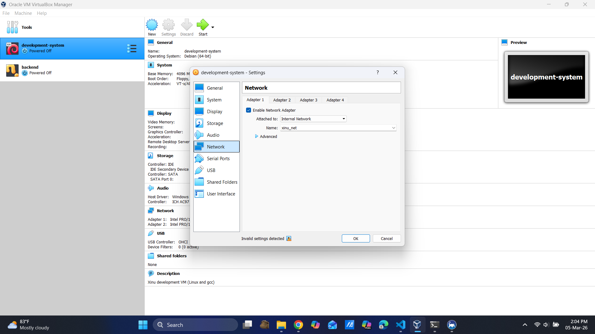
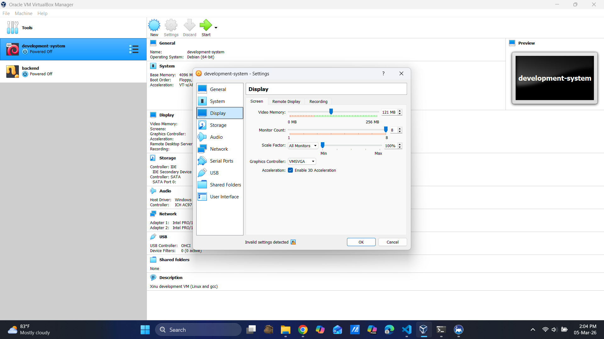
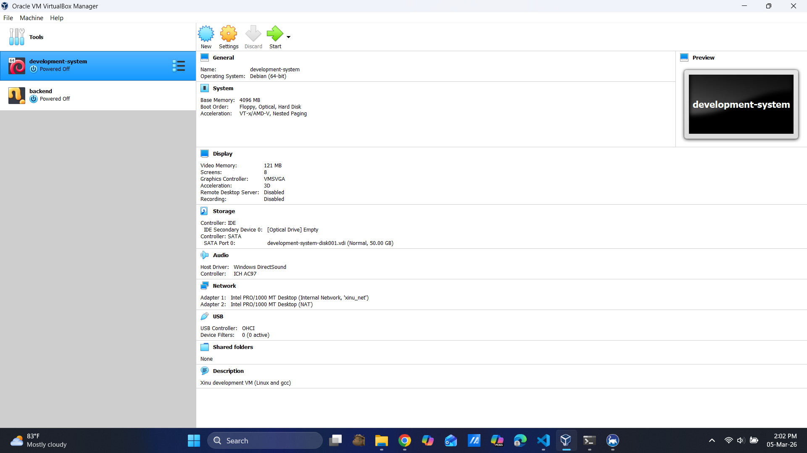
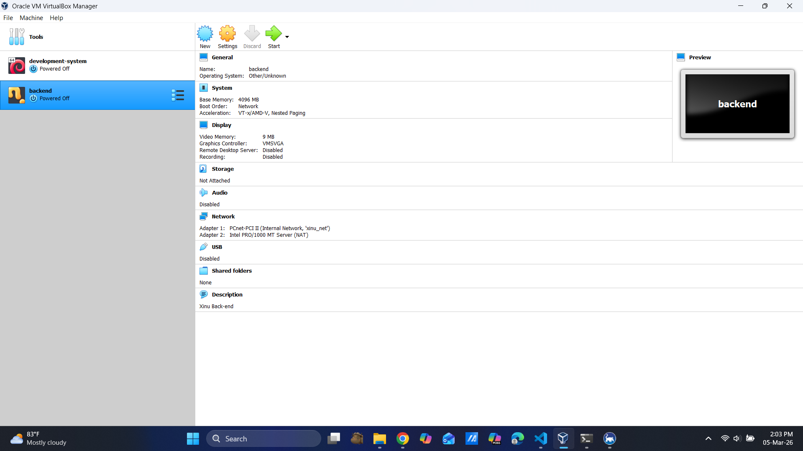
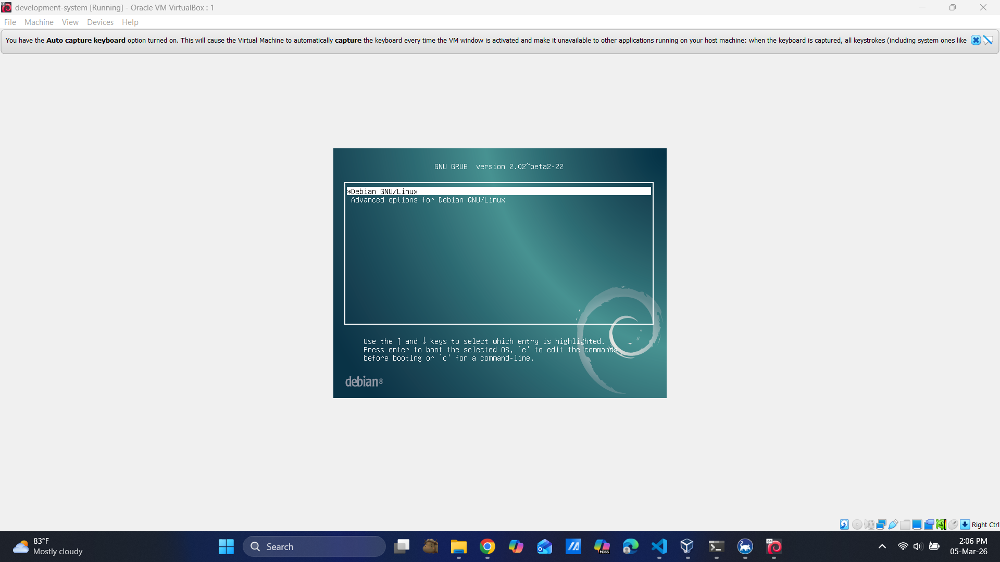
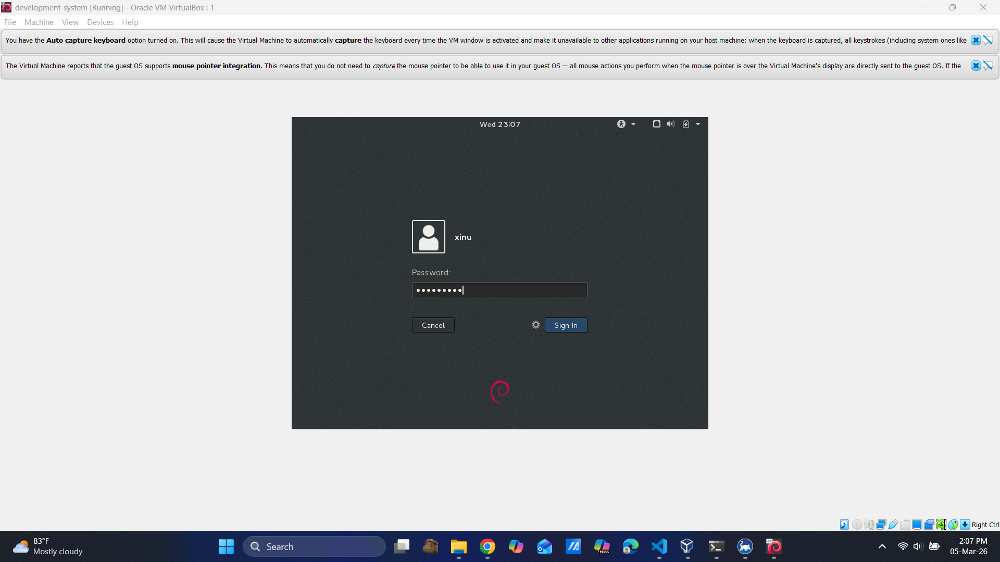

# <h1 align="center">Laporan Praktikum Modul II   Instalasi Xinu</h1>

Viona Aziz Syahputri - 2311104008

## Dasar Teori
Pada modul Instalasi Xinu mempelajari tentang proses instalasi **Xinu OS** yang akan digunakan sebagai bahan pembelajaran pada praktikum Sistem Operasi. Xinu merupakan sistem operasi sederhana yang biasanya digunakan untuk tujuan pendidikan agar lebih mudah memahami konsep dasar sistem operasi seperti manajemen proses, memori, dan komunikasi antar sistem. Karena Xinu dirancang untuk lingkungan embedded system, maka proses pengembangannya tidak dijalankan langsung pada komputer utama, tetapi menggunakan mesin virtual melalui aplikasi VirtualBox. Dengan menggunakan virtual machine, aku bisa menjalankan beberapa sistem operasi dalam satu komputer tanpa mengganggu sistem utama yang digunakan.

Dalam proses instalasi Xinu, digunakan dua virtual machine yaitu **development-system** dan **backend**. Development-system berfungsi sebagai tempat aku melakukan pengembangan Xinu seperti mengedit source code, melakukan compile, dan menyiapkan file image sistem operasi. Virtual machine ini menggunakan sistem operasi Debian Linux yang sudah dilengkapi dengan berbagai tools seperti compiler, DHCP server, dan TFTP server. Sedangkan backend berfungsi sebagai komputer target yang nantinya akan menjalankan Xinu OS yang sudah dibuat sebelumnya. Dengan arsitektur ini, proses pengembangan dan proses menjalankan sistem operasi dipisahkan sehingga lebih mudah dipahami dan dikelola selama praktikum berlangsung.

## Guided

<h4 align="center">Setting Virtual Box</h4>

<h4 align="center">File -> import Appliance -> Pilih backend.ova -> Next</h4>

<h4 align="center">Network Setting Adapter 1</h4>

<h4 align="center">Display Setting Screen</h4>

<h4 align="center">Serial Ports 1</h4>

<h4 align="center">Hasil Akhir Development System</h4>

<h4 align="center">Hasil Akhir Backend System</h4>

<h4 align="center">Login development System</h4>

<h4 align="center">Masuk kedalam xinu</h4>

## Referensi
1. [https://medium.com/@moch.andyyusuf.h.e.p/memuat-xinu-di-virtualbox-a-step-by-step-guide-9929e776c35b](https://medium.com/@moch.andyyusuf.h.e.p/memuat-xinu-di-virtualbox-a-step-by-step-guide-9929e776c35b)