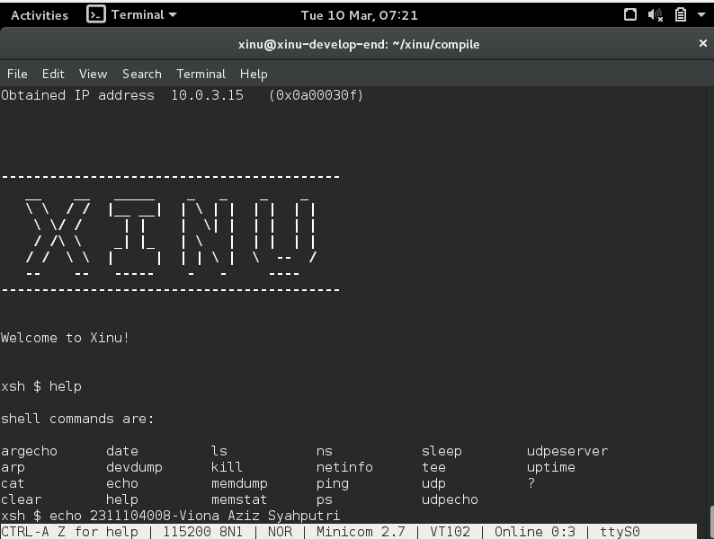
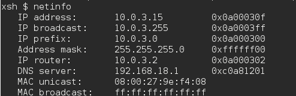
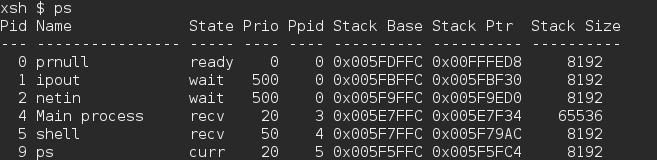

# <h1 align="center">Laporan Praktikum Modul III   Eksplorasi Xinu</h1>

Viona Aziz Syahputri - 2311104008

## Dasar Teori
Xinu merupakan sistem operasi sederhana untuk belajar mengenai sistem operasi.Pada praktikum Modul 3 Xinu dijalankan menggunakan dua virtual machine yangitu development system dan backend. Development-system digunakan untuk melakukan proses mengelola dan mengomplilasi source code Xinu, sedangkan backend sendiri digunakan untuk menjalankan sistem operasinya.Setelah menjalankan development-system, praktikan perlu berpindah ke direktor xinu/compile engan menggunakan perintah cd xinu/compile/. Direktori sendiri merupakan tempat penyimpanan file atau folder pada sistem operasi Linux yang mirip dengan folder pada Windows. Setelah berada pada direktori tersebut, dilakukan pembersihan file hasil kompilasi sebelumnya menggunakan perintah make clean kemudian dilanjutkan dengan proses kompilasi menggunakan perintah make.

Proses kompilasi tersebut akan menghasilkan file image Xinu yang nantinya digunakan oleh backend virtual machine untuk melakukan proses booting. Backend akan mengambil file image tersebut melalui jaringan menggunakan mekanisme PXE sehingga sistem operasi Xinu dapat dijalankan. Setelah proses booting berhasil, praktikan dapat berinteraksi dengan sistem operasi Xinu melalui terminal menggunakan aplikasi minicom. Jika proses berjalan dengan baik, pada terminal akan muncul prompt xsh$ yang menandakan bahwa sistem operasi Xinu sudah aktif dan siap menerima perintah dari pengguna.

## Guided

**Perintah-perintah pada Shell Xinu**

    help      : menampilkan daftar perintah yang tersedia pada shell Xinu

    ?         : menampilkan daftar perintah pada shell Xinu (sama seperti help)

    argecho   : menampilkan kembali argumen yang dimasukkan pada perintah

    arp       : menampilkan tabel ARP yang berisi pasangan IP Address dan MAC Address

    cat       : menampilkan isi file ke layar

    clear     : membersihkan tampilan layar terminal

    date      : menampilkan tanggal dan waktu sistem

    devdump   : menampilkan informasi perangkat pada sistem

    echo : menampilkan teks atau pesan ke layar

    kill      : menghentikan proses berdasarkan PID

    ls        : menampilkan daftar file atau direktori

    memdump   : menampilkan isi memori pada alamat tertentu

    memstat   : menampilkan informasi penggunaan memori sistem

    netinfo   : menampilkan informasi konfigurasi jaringan

    ns        : melakukan query ke DNS (Name Server)

    ping      : mengecek koneksi jaringan ke alamat IP tertentu

    ps        : menampilkan daftar proses yang sedang berjalan

    sleep     : menunda proses selama beberapa detik

    tee       : menyalin output ke layar dan ke file

    udp       : mengirim paket data menggunakan protokol UDP

    udpecho   : mengirim dan menerima kembali pesan UDP (echo)

    udpserver : menjalankan server UDP untuk menerima pesan

    uptime    : menampilkan lama waktu sistem telah berjalan

**Jawaban Pertanyaan**

1. Berapa jumlah perintah pada Xinu?
Jumlah perintah pada Xinu adalah 23 perintah.

2. Sebutkan 2 perintah yang mempunyai fungsi yang sama!
help dan ? memiliki perintah dan output yang sama

3. Berapa IP address Xinu?
IP address Xinu adalah 10.0.3.15

4. Perintah apa yang digunakan untuk mengetahui IP address?
Perintah yang digunakan adalah netinfo

5. Berapa IP DNS server yang digunakan oleh Xinu?
IP DNS server yang digunakan oleh Xinu adalah 192.168.18.1. Hal ini dapat diketahui dengan menjalankan perintah netinfo, yang menampilkan informasi konfigurasi jaringan termasuk IP address, router, dan DNS server.

6. Terdapat berapa proses yang sedang berjalan pada Xinu?
Terdapat sekitar 6 proses yang sedang berjalan.

7. Proses apa yang mempunyai prioritas paling rendah?
Berdasarkan hasil perintah ps pada Xinu, proses yang memiliki prioritas paling rendah yaitu prnull dengan nilai prioritas 0

8. Proses apa yang mempunyai ukuran paling besar?
Berdasarkan hasil perintah ps pada Xinu, proses yang memiliki ukuran stack paling besar adalah Main process dengan ukuran 65536 byte

9. Proses apa yang berada dalam state current?
Berdasarkan hasil perintah ps pada Xinu, Proses yang berada pada state current adalah Main process.

10. Proses apa yang berada dalam state suspend?
Berdasarkan perintah ps pada Xinu, tidak terdapat proses yang berada dalam state suspend. State yang muncul hanya ready, wait, curr, recv, dan sleep.

11. Berapa PID dari Main process?
PID dari Main process adalah 3.

## Referensi
1. [https://telkomuniversityofficial-my.sharepoint.com/shared?listurl=https%3A%2F%2Ftelkomuniversityofficial-my.sharepoint.com%2Fpersonal%2Fmaghaz_student_telkomuniversity_ac_id%2FDocuments&id=%2Fpersonal%2Fmaghaz_student_telkomuniversity_ac_id%2FDocuments%2F2026%2F00.+Modul+Praktikum+Sistem+Operasi+SE+2526-2.pdf&parent=%2Fpersonal%2Fmaghaz_student_telkomuniversity_ac_id%2FDocuments%2F2026&shareLink=1&ga=1](https://telkomuniversityofficial-my.sharepoint.com/shared?listurl=https%3A%2F%2Ftelkomuniversityofficial-my.sharepoint.com%2Fpersonal%2Fmaghaz_student_telkomuniversity_ac_id%2FDocuments&id=%2Fpersonal%2Fmaghaz_student_telkomuniversity_ac_id%2FDocuments%2F2026%2F00.+Modul+Praktikum+Sistem+Operasi+SE+2526-2.pdf&parent=%2Fpersonal%2Fmaghaz_student_telkomuniversity_ac_id%2FDocuments%2F2026&shareLink=1&ga=1)