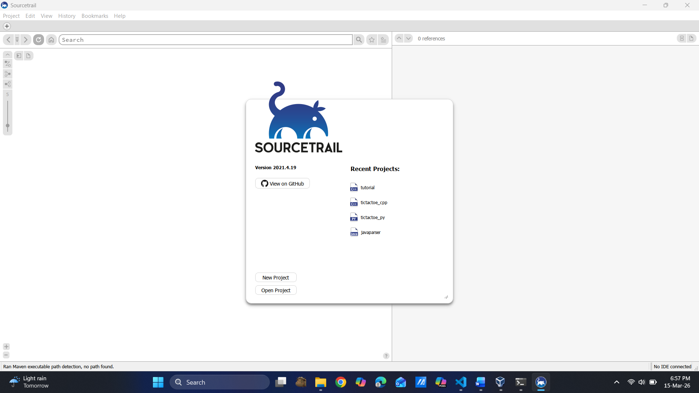
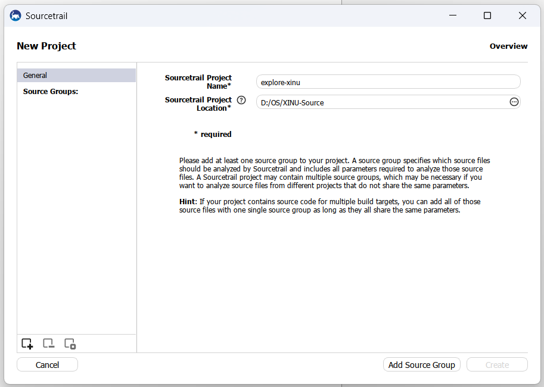
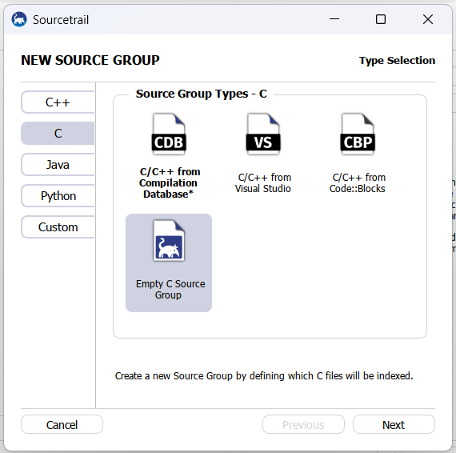
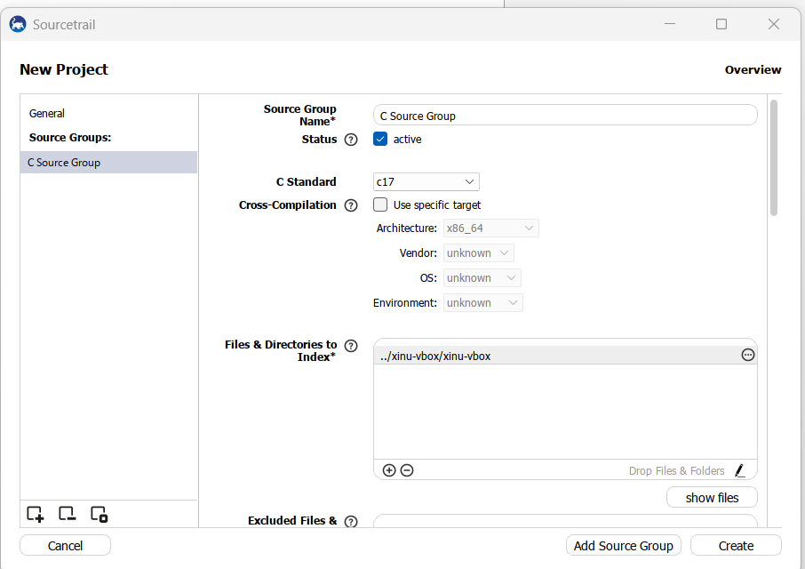
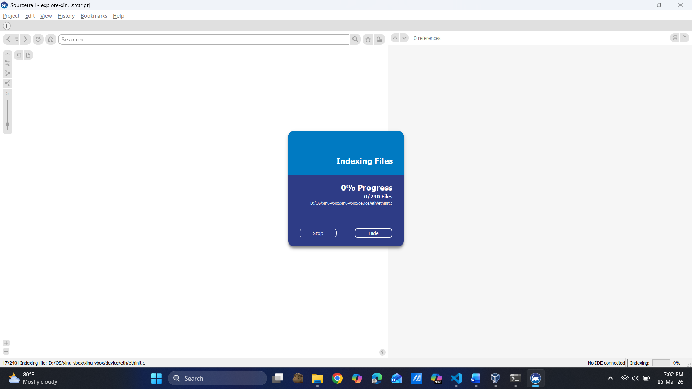
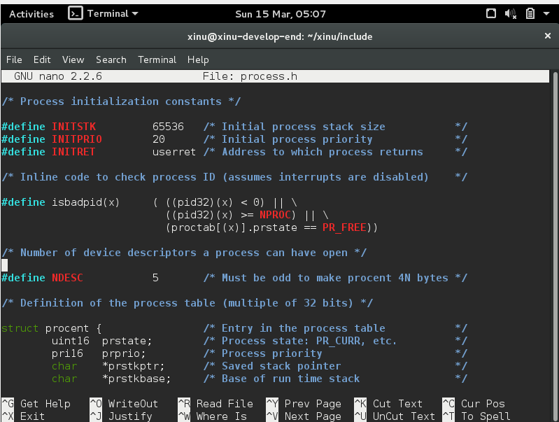
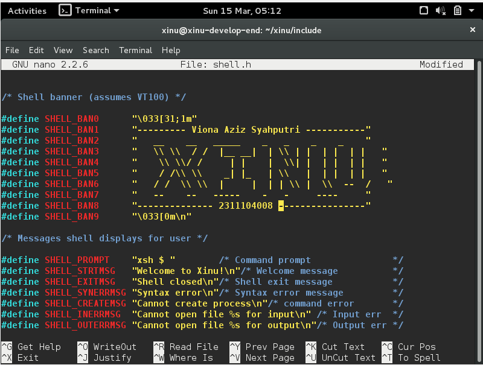
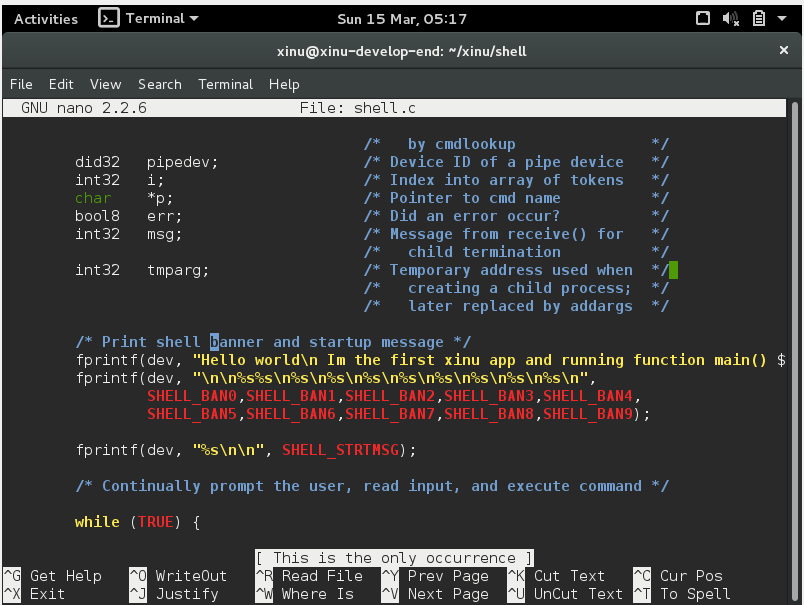
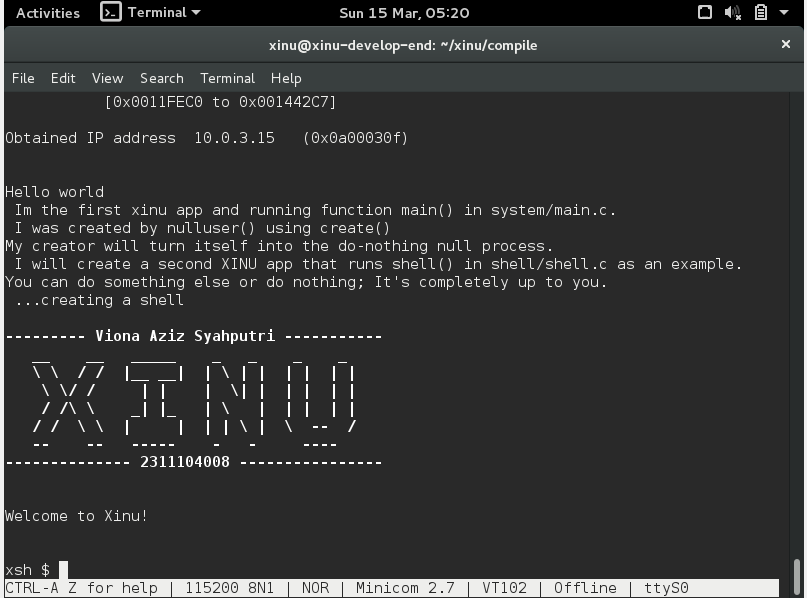

# <h1 align="center">Laporan Praktikum Modul IV   Membaca Source Code Xinu</h1>

Viona Aziz Syahputri - 2311104008

## Dasar Teori
Pada modul ini praktikan mempelajari cara memahami dan membaca source code dari sistem operasi Xinu. Xinu merupakan sistem operasi yang dirancang untuk sistem embedded sehingga proses pengembangannya menggunakan paradigma cross-development. Dalam paradigma ini, proses penulisan kode, pengeditan, dan proses compile dilakukan pada komputer biasa seperti PC atau laptop yang menggunakan sistem operasi Windows atau Linux. Hasil dari proses tersebut berupa file image yang berisi sistem operasi Xinu yang sudah lengkap. File image tersebut kemudian dipindahkan ke perangkat target seperti embedded system atau microcontroller agar sistem operasi dapat dijalankan pada perangkat tersebut.

Bahasa pemrograman yang digunakan dalam pengembangan Xinu adalah bahasa C karena mampu berinteraksi langsung dengan hardware. Source code Xinu juga tersusun dalam beberapa direktori seperti compile, config, device, include, shell, dan system yang masing-masing memiliki fungsi berbeda, misalnya folder system berisi kode kernel dan folder shell berisi perintah-perintah pada shell Xinu. Selain itu terdapat beberapa file penting seperti xinu.h, process.h, dan semaphore.h yang digunakan dalam pengelolaan proses dan resource sistem. Untuk membantu memahami hubungan antar kode program, digunakan tool SourceTrail yang memudahkan praktikan dalam menelusuri fungsi dan struktur program pada source code Xinu.

## Guided
1. [10 Poin] Apa nama image yang dihasilkan setelah melakukan kompilasi pada Xinu? Berapa ukuran file tersebut? Ada pada folder apa file image tersebut? 
Hint: baca kembali modul-modul sebelumnya
jawab: image yang dikompilasi ketika make xinu adalah xinu.elf dengan ukuran 150Kb, folder dari file tersebut berada pada xinu/compile

2. Membaca source code Xinu
    - Buka aplikasi Sourcetrail
    
    - klik new project -> isikan nama dan lokasi project
    
    - klik Add source grup -> pilih c -> pilih Empty C Source Grup
    
    - Tambah File & Directory dan berikan alamat directory Xinu-xbox yang ada di drive dan tambahkan directory include
    
    - Setelah itu create
    
    - Selesai.

3. [10 Poin] Carilah struktur data dari proses pada Xinu OS. Struktur data proses ada pada file apa? Informasi apa saja yang disimpan dalam struktur data tersebut? 
Hint: file berektensi .h

struktur data process didapat di file process.h yang ada pada xinu/include, informasi yang tersimpan pada struktur data tersebut adalah informasi mengenai proses yang ada pada Xinu

4. [80 poin] Mengubah welcome banner pada Xinu
Mengubah welcome banner dapat di lakukan di 2 file yaitu shell.h yang ada pada folder xinu/include dan juga shell.c yang berada di folder xinu/shell
a. ubah beberapa baris kode pada shell.h

b. ubah beberapa baris kode pada shell.c

setelah itu, make clean -> make -> sudo minicom -> run backend

## Referensi
1. [https://telkomuniversityofficial-my.sharepoint.com/shared?listurl=https%3A%2F%2Ftelkomuniversityofficial-my.sharepoint.com%2Fpersonal%2Fmaghaz_student_telkomuniversity_ac_id%2FDocuments&id=%2Fpersonal%2Fmaghaz_student_telkomuniversity_ac_id%2FDocuments%2F2026%2F00.+Modul+Praktikum+Sistem+Operasi+SE+2526-2.pdf&parent=%2Fpersonal%2Fmaghaz_student_telkomuniversity_ac_id%2FDocuments%2F2026&shareLink=1&ga=1](https://telkomuniversityofficial-my.sharepoint.com/shared?listurl=https%3A%2F%2Ftelkomuniversityofficial-my.sharepoint.com%2Fpersonal%2Fmaghaz_student_telkomuniversity_ac_id%2FDocuments&id=%2Fpersonal%2Fmaghaz_student_telkomuniversity_ac_id%2FDocuments%2F2026%2F00.+Modul+Praktikum+Sistem+Operasi+SE+2526-2.pdf&parent=%2Fpersonal%2Fmaghaz_student_telkomuniversity_ac_id%2FDocuments%2F2026&shareLink=1&ga=1)