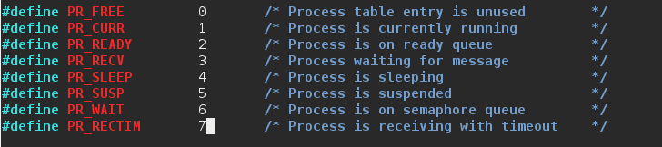
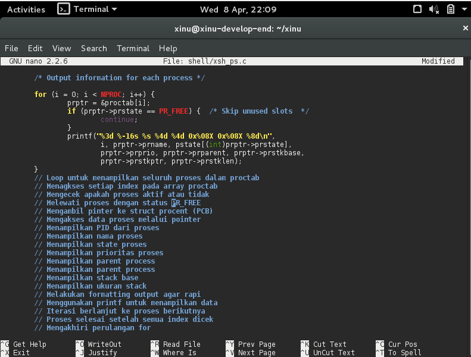
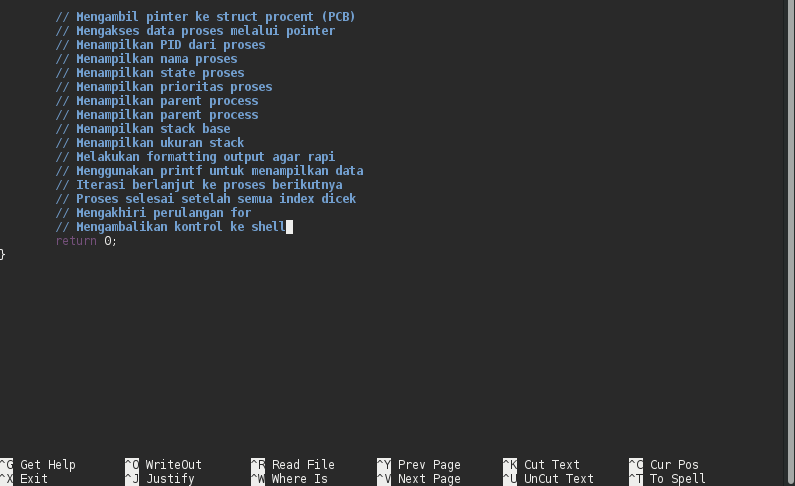
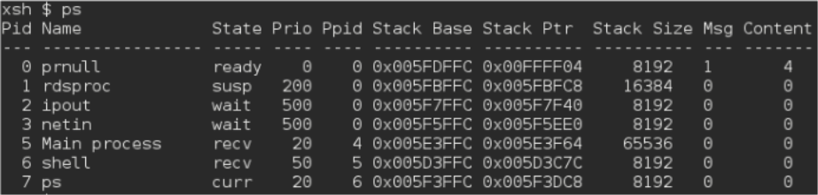
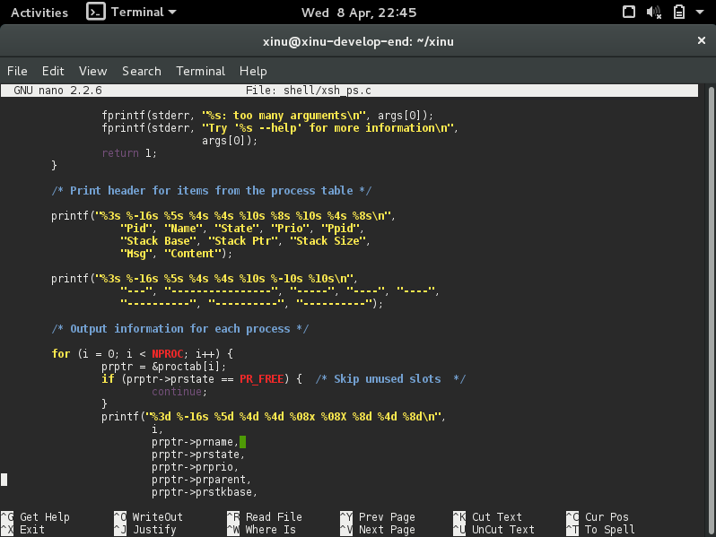
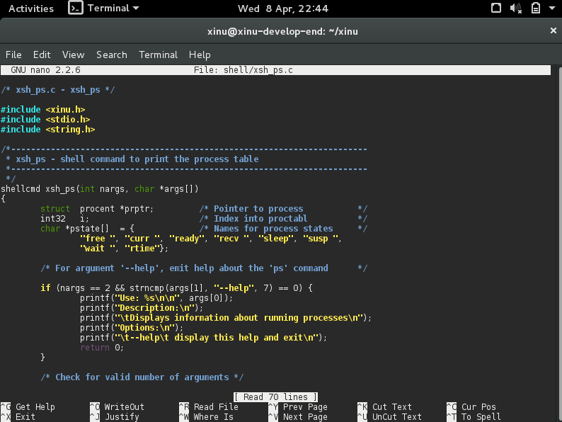
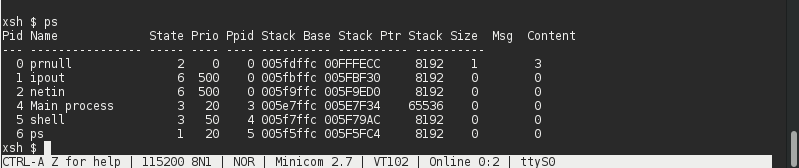
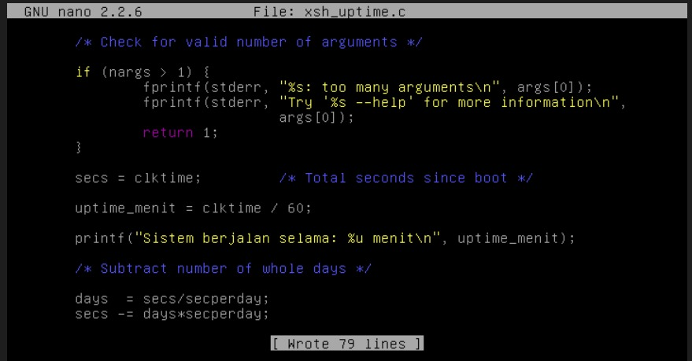

# <h1 align="center">Laporan Praktikum Modul V   Eksplorasi Proses Xinu</h1>

Viona Aziz Syahputri - 2311104008

## Dasar Teori
Pada sistem operasi Xinu, proses adalah program yang sedang dijalankan oleh sistem. Semua informasi yang berkaitan dengan proses disimpan dalam sebuah struktur data yang disebut process table. Setiap proses memiliki satu entri di dalam tabel tersebut yang akan dibuat saat proses dijalankan dan dihapus ketika proses selesai. Informasi penting dari setiap proses disimpan dalam Process Control Block (PCB) yang pada Xinu direpresentasikan dalam bentuk struct procent. Di dalamnya terdapat data seperti status proses, prioritas, penggunaan stack, nama proses, dan informasi lain yang dibutuhkan sistem untuk mengatur jalannya proses.

Pengelolaan proses di Xinu dilakukan menggunakan array global bernama proctab[], di mana setiap indeks pada array tersebut mewakili satu proses. Xinu tidak menggunakan PID secara terpisah, melainkan langsung menggunakan indeks array sebagai identitas proses. Misalnya, proctab[3] berarti proses dengan ID 3. Dengan cara ini, sistem bisa langsung mengakses dan mengatur proses, seperti mengubah prioritas atau melihat nama proses melalui struktur struct procent. Pendekatan ini membuat pengelolaan proses di Xinu menjadi lebih sederhana dan mudah dipahami.

## Guided
1. [10 Poin] Jawablah pertanyaan berikut ini: 
<ol type="a">
   <li>Berapa banyaknya maksimum proses yang ada pada Xinu?</li> 
   <b>Jawab: 50 proses</b>
   
   
   <li>Berapa maksimal panjang nama suatu proses pada Xinu?</li> 
   <b>Jawab: 16</b>
   
   <li>Berapa nilai prioritas awal pada saat proses dibuat?</li>
   <b>Jawab: 20</b>
   <li>Ada berapa total state pada Xinu? Sebutkan!</li>
   <b>Jawab: 8</b>
   
</ol>

2. [20 Poin] Perintah ps adalah perintah untuk menampilkan statistik process yang berjalan. Source code dari ps tersimpan pada file xsh_ps.c. Carilah file tersebut dan beri komentar pada 20 baris terakhir di source code tersebut!

3. [35 Poin] Ubahlah perintah ps (source code: xsh_ps.c) pada Xinu sehingga menampilkan informasi tambahan berupa kolom yang berisi total message yang ada pada proses seperti gambar di bawah ini:

Kolom Msg adalah banyaknya pesan yang ada dalam proses.
Kolom Content adalah isi dari pesan tersebut.
Langkah pengerjaan:
    - Modifikasi source code pada file xsh_ps.c
    - Kompilasi ulang Xinu dengan perintah seperti pada modul sebelumnya 
    - Jalankan Backend VM 
    - Setelah sistem berjalan, jalankan perintah $ps. Pastikan hasilnya sesuai dengan contoh output pada gambar yang diberikan.
    - Screenshot source kode dan output akhir hasil modifikasi

4. [35 Poin] Ubahlah perintah uptime pada Xinu sehingga menampilkan lamanya Xinu sejak booting hanya dalam satuan menit.
Langkah pengerjaan:
    - Modifikasi source code pada file xsh_uptime.c
    - Kompilasi ulang Xinu dengan perintah seperti pada modul sebelumnya 
    - Jalankan Backend VM 
    - Setelah sistem berjalan, jalankan perintah $uptime. Pastikan hasilnya sesuai dengan contoh output yang diinginkan
    - Screenshot source kode dan output akhir hasil modifikasi

## Referensi
1. [https://telkomuniversityofficial-my.sharepoint.com/shared?listurl=https%3A%2F%2Ftelkomuniversityofficial-my.sharepoint.com%2Fpersonal%2Fmaghaz_student_telkomuniversity_ac_id%2FDocuments&id=%2Fpersonal%2Fmaghaz_student_telkomuniversity_ac_id%2FDocuments%2F2026%2F00.+Modul+Praktikum+Sistem+Operasi+SE+2526-2.pdf&parent=%2Fpersonal%2Fmaghaz_student_telkomuniversity_ac_id%2FDocuments%2F2026&shareLink=1&ga=1](https://telkomuniversityofficial-my.sharepoint.com/shared?listurl=https%3A%2F%2Ftelkomuniversityofficial-my.sharepoint.com%2Fpersonal%2Fmaghaz_student_telkomuniversity_ac_id%2FDocuments&id=%2Fpersonal%2Fmaghaz_student_telkomuniversity_ac_id%2FDocuments%2F2026%2F00.+Modul+Praktikum+Sistem+Operasi+SE+2526-2.pdf&parent=%2Fpersonal%2Fmaghaz_student_telkomuniversity_ac_id%2FDocuments%2F2026&shareLink=1&ga=1)