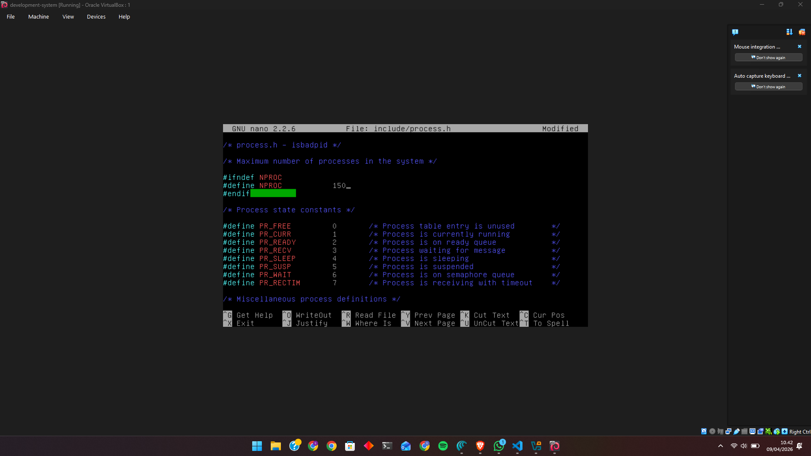
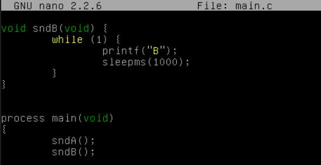
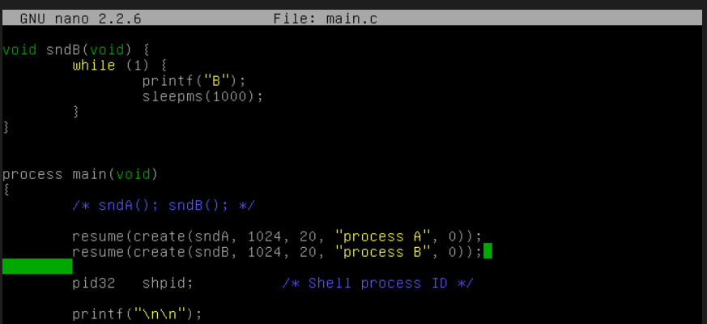

# <h1 align="center">Laporan Praktikum Modul VI <br> Sekuensial Konkuren</h1>
<p align="center">Viona Aziz Syahputri - 2311104008</p>

## Dasar Teori
Sekuensial program adalah model eksekusi program di mana instruksi dijalankan secara berurutan, satu per satu, sesuai dengan urutan penulisan kode. Dalam model ini, prosesor hanya fokus pada satu alur eksekusi sehingga suatu instruksi harus selesai terlebih dahulu sebelum instruksi berikutnya dijalankan. Tidak ada proses yang berjalan secara bersamaan, sehingga alur program bersifat linear dan mudah dipahami. Konsep ini biasanya digunakan pada program sederhana karena tidak melibatkan manajemen banyak proses atau pembagian sumber daya secara kompleks.

Sebaliknya, konkuren program adalah model eksekusi yang memungkinkan lebih dari satu proses atau tugas berjalan dalam waktu yang bersamaan atau saling bergantian. Pada sistem operasi, konkuren dicapai melalui mekanisme penjadwalan CPU, di mana beberapa proses dapat dijalankan secara bergantian dalam waktu yang sangat cepat sehingga terlihat seperti berjalan bersamaan. Konsep ini bertujuan untuk meningkatkan efisiensi dan pemanfaatan sumber daya sistem, terutama pada sistem multitasking. Dengan adanya konkurensi, sebuah program dapat menangani beberapa pekerjaan sekaligus tanpa harus menunggu satu proses selesai terlebih dahulu.

## Guided
1. [10 Poin] Selain hardware (memory), batasan maksimal proses dapat ditentukan dengan secara software.  Pada Linux maksimal proses adalah 4194303 proses (64 bit) dan 32767 proses (32 bit) dapat dilihat melalui perintah $cat /proc/sys/kernel/pid_max Carilah pada source code Xinu yang memberi batasan mengenai banyaknya proses yang bisa dibuat! Berapa maksimal proses dalam Xinu?  Ubah menjadi maksimal 150 proses! 


2. [20 Poin] Jalankan kode sekuensial! 


3. [20 Poin] Jalankan kode konkuren! 



4. [50 Poin] Buatlah 2 proses produser dan konsumer. Produser memproduksi angka integer dari 1-1000. Konsumer mengkonsumsi integer yang diproduksi oleh produser dan menampilkannya! (Gunakan variabel global bertipe int32 bernama n yang digunakan secara bersama oleh kedua proses)
    
   ```
   int32 n = 0; //global variabel

   void produser(void){
   int32 i;
   for (i=1; i<=1000; i++){
   n++;
   }
   }

   void konsumer(void){
   int32 i;
   for (i=1; i<=1000; i++){
       printf("Nilai dari n adalah %d\n",n);
   }
   }
   ```

    Hasil dari program ini cukup mengejutkan (tidak akan sesuai dengan intuisi awal). Jelaskan mengapa hasilnya seperti itu!

    Hasil dari program produser-konsumer tersebut tidak sesuai dengan yang diharapkan karena terjadi race condition dan kedua proses berjalan secara bersamaan tanpa adanya sinkronisasi. Secara logika, seharusnya nilai n akan bertambah dari 1 sampai 1000 lalu ditampilkan secara berurutan. Tapi kenyataannya tidak seperti itu, karena produser dan konsumer sama-sama mengakses variabel global n tanpa aturan yang jelas, jadi keduanya seperti “berebut” saat membaca dan mengubah nilainya.

    Selain itu, sistem operasi memakai penjadwalan preemptive, jadi suatu proses bisa dihentikan kapan saja dan diganti proses lain. Akibatnya urutan eksekusinya jadi tidak teratur. Konsumer bisa saja mencetak nilai yang sama berkali-kali, atau malah ada angka yang terlewat karena produser sudah menambah nilai n lebih dulu sebelum sempat dibaca. Karena tidak ada mekanisme seperti semaphore atau mutex untuk mengatur aksesnya, hasil akhirnya jadi tidak berurutan dan terlihat acak.


## Referensi
1. [https://telkomuniversityofficial-my.sharepoint.com/shared?listurl=https%3A%2F%2Ftelkomuniversityofficial-my.sharepoint.com%2Fpersonal%2Fmaghaz_student_telkomuniversity_ac_id%2FDocuments&id=%2Fpersonal%2Fmaghaz_student_telkomuniversity_ac_id%2FDocuments%2F2026%2F00.+Modul+Praktikum+Sistem+Operasi+SE+2526-2.pdf&parent=%2Fpersonal%2Fmaghaz_student_telkomuniversity_ac_id%2FDocuments%2F2026&shareLink=1&ga=1](https://telkomuniversityofficial-my.sharepoint.com/shared?listurl=https%3A%2F%2Ftelkomuniversityofficial-my.sharepoint.com%2Fpersonal%2Fmaghaz_student_telkomuniversity_ac_id%2FDocuments&id=%2Fpersonal%2Fmaghaz_student_telkomuniversity_ac_id%2FDocuments%2F2026%2F00.+Modul+Praktikum+Sistem+Operasi+SE+2526-2.pdf&parent=%2Fpersonal%2Fmaghaz_student_telkomuniversity_ac_id%2FDocuments%2F2026&shareLink=1&ga=1)