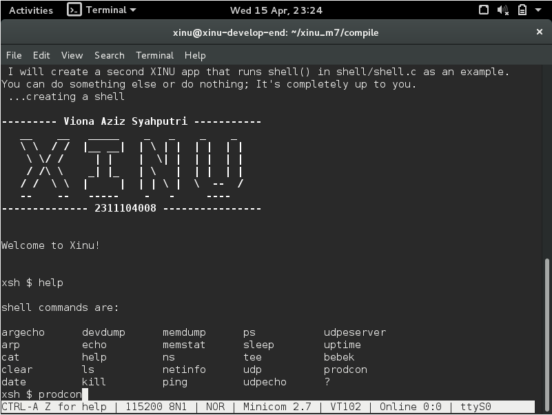
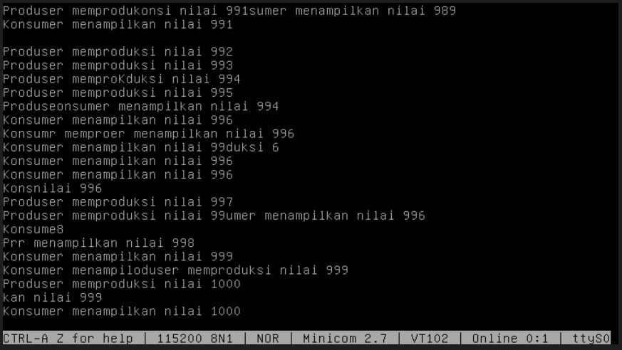

# <h1 align="center">Laporan Praktikum Modul VII   Semaphore</h1>

Viona Aziz Syahputri - 2311104008

## Dasar Teori
Semaphore merupakan salah satu mekanisme sinkronisasi yang digunakan dalam sistem operasi untuk mengatur akses terhadap resource yang digunakan secara bersama oleh beberapa proses. Dengan adanya semaphore, proses-proses yang berjalan secara konkuren dapat diatur agar tidak saling mengganggu, terutama ketika mengakses variabel atau data yang sama. Pada sistem seperti Xinu, semaphore digunakan untuk mencegah terjadinya masalah seperti race condition, yaitu kondisi ketika beberapa proses mengakses dan memodifikasi data secara bersamaan tanpa kontrol yang jelas.

Dalam implementasinya, semaphore memiliki tiga operasi utama yaitu inisiasi, wait, dan signal. Inisiasi dilakukan untuk membuat semaphore dengan nilai awal tertentu menggunakan semcreate(). Operasi wait() digunakan untuk mengurangi nilai semaphore, dan jika nilainya menjadi negatif maka proses akan ditahan (block) sampai semaphore tersedia kembali. Sedangkan signal() berfungsi untuk menambah nilai semaphore dan membangunkan proses lain yang sedang menunggu. Selain itu, terdapat pola penggunaan semaphore seperti signaling dan mutex. Signaling digunakan untuk mengatur urutan eksekusi antar proses, sedangkan mutex digunakan untuk memastikan hanya satu proses yang dapat mengakses bagian kritis (critical section) dalam satu waktu.

## Guided
1. [50 poin] Buatlah 3 buah proses yaitu P1, P2 dan P3. P1 selalu menampilkan “kwak”, P2 selalu menampilkan “kwik”, P3 selalu menampilkan “kwek”. Menggunakan 3 proses tersebut dan beberapa buah semaphore, buatlah program yang dapat menampilkan: 
Kwak
Kwik
Kwek
Kwak
Kwik
Kwek
…

2. [50 poin] Buatlah proses bernama produser yang memproduksi bilangan 1-1000. Buatlah proses bernama konsumer yang akan menampilkan nilai yang diproduksi oleh produser. Gunakan semaphore! 
Produser memproduksi nilai 1
Konsumer menampilkan nilai 1
Produser memproduksi nilai 2
Konsumer menampilkan nilai 2
….
Produser memproduksi nilai 1000
Konsumer menampilkan nilai 1000
Catatan: harus menggunakan semaphore, proses konkuren, tidak boleh hanya 1 proses dan hanya menggunakan while loop kemudian print.

## Referensi
1. [https://telkomuniversityofficial-my.sharepoint.com/shared?listurl=https%3A%2F%2Ftelkomuniversityofficial-my.sharepoint.com%2Fpersonal%2Fmaghaz_student_telkomuniversity_ac_id%2FDocuments&id=%2Fpersonal%2Fmaghaz_student_telkomuniversity_ac_id%2FDocuments%2F2026%2F00.+Modul+Praktikum+Sistem+Operasi+SE+2526-2.pdf&parent=%2Fpersonal%2Fmaghaz_student_telkomuniversity_ac_id%2FDocuments%2F2026&shareLink=1&ga=1](https://telkomuniversityofficial-my.sharepoint.com/shared?listurl=https%3A%2F%2Ftelkomuniversityofficial-my.sharepoint.com%2Fpersonal%2Fmaghaz_student_telkomuniversity_ac_id%2FDocuments&id=%2Fpersonal%2Fmaghaz_student_telkomuniversity_ac_id%2FDocuments%2F2026%2F00.+Modul+Praktikum+Sistem+Operasi+SE+2526-2.pdf&parent=%2Fpersonal%2Fmaghaz_student_telkomuniversity_ac_id%2FDocuments%2F2026&shareLink=1&ga=1)