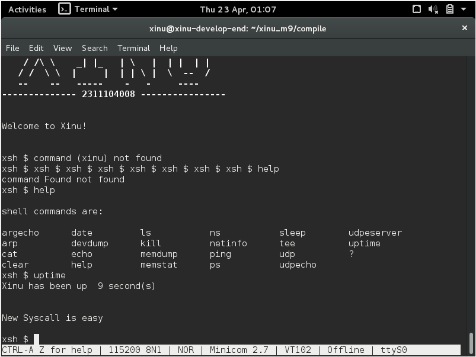
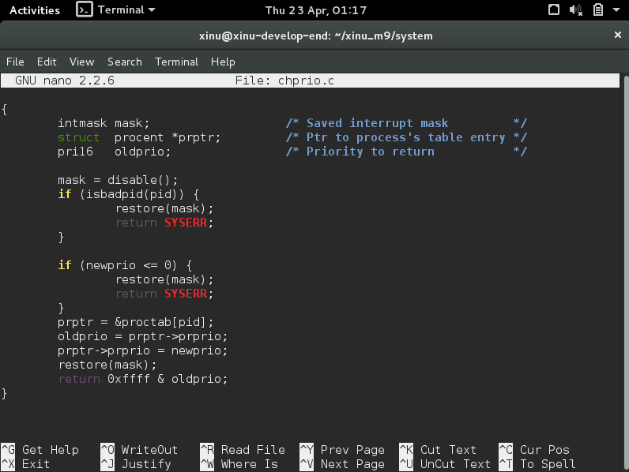
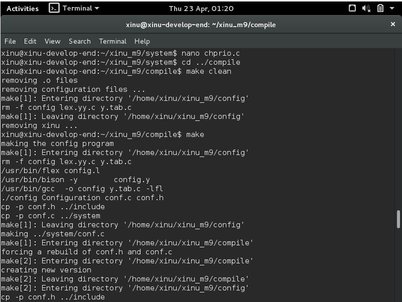
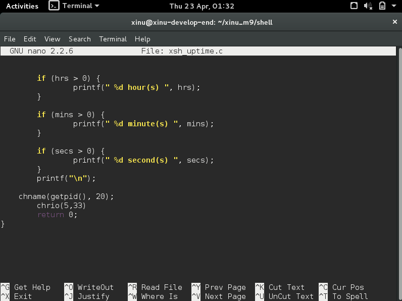
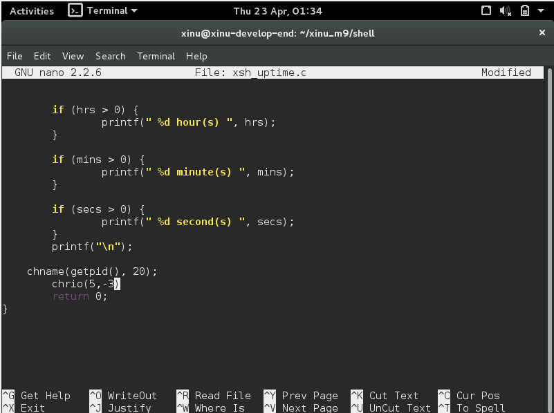

# <h1 align="center">Laporan Praktikum Modul IX <br>Syscall Xinu</h1>
<p align="center">Viona Aziz Syahputri - 2311104008</p>

## Dasar Teori
System call atau syscall itu bisa dibilang sebagai penghubung antara program yang kita jalankan dengan sistem operasi. Jadi kalau program butuh sesuatu dari OS, misalnya akses memori, ubah prioritas proses, atau menampilkan output, dia nggak bisa langsung akses ke kernel, tapi harus lewat syscall. Hal ini dilakukan supaya sistem tetap aman, karena kernel nggak boleh diakses sembarangan oleh program user.
Di Xinu, cara kerja syscall dimulai dengan mematikan interrupt dulu supaya tidak ada proses lain yang mengganggu saat syscall berjalan. Setelah itu, sistem akan mengecek semua parameter yang diberikan, apakah valid atau tidak. Kalau sudah benar, barulah syscall menjalankan tugas utamanya, misalnya mengubah prioritas proses. Setelah selesai, interrupt diaktifkan kembali dan hasil dari syscall dikembalikan ke program, apakah berhasil atau gagal.
Selain itu, Xinu menyediakan template standar untuk membuat syscall agar semua syscall memiliki struktur yang sama dan lebih mudah dikelola. Kita juga bisa membuat syscall baru dengan menambahkan file di folder system dan mendaftarkannya di prototypes.h. Dengan adanya syscall ini, program bisa menggunakan layanan sistem operasi dengan lebih aman dan terstruktur.

## Guided
1. [50 Poin] Buat syscall baru seperti yang ditunjukkan pada modul syscall poin 9.5!
(sertakan Screenshot kode dan hasil run)


2. [25 Poin] Perbaiki syscall chprio (xinu/system/chprio.c) dengan memperhatikan validasi
input
- Pastikan id adalah angka dari 0 – NPROC (ukuran maks banyaknya proses)
- Pastikan prioritas adalah bilangan yang positif


- Compile dan jalankan Xinu dengan syscall yang telah diperbaiki
● make clean
● make



3. Lakukan hal-hal berikut ini
Edit xsh_uptime.c
Tambahkan kode berikut

```
Compile source code tersebut dengan perintah
make clean
make

Jalankan perintah ps
xsh $ ps
perhatikan prioritas proses dengan id = 5 

Jalankan uptime 
xsh $ uptime
Perhatikan hasil perintah tersebut

Jalankan ps
xsh $ ps
perhatikan prioritas proses dengan id = 5 seharusnya sudah berubah
```

[25 Poin] Testing chprio syscall yang telah diubah
Testing prioritas tidak boleh < 0: Ubah “chprio(5,33)” menjadi “chprio(5,-3)” pada xsh_uptime.c
Testing id adalah valid: Ubah “chprio(5,33)” menjadi “chprio(3000,3)”
Hasil dua testing di atas adalah prioritas tidak berubah karena salah argument (dibuktikan dengan menggunakan perintah ps)




## Referensi
1. [https://telkomuniversityofficial-my.sharepoint.com/shared?listurl=https%3A%2F%2Ftelkomuniversityofficial-my.sharepoint.com%2Fpersonal%2Fmaghaz_student_telkomuniversity_ac_id%2FDocuments&id=%2Fpersonal%2Fmaghaz_student_telkomuniversity_ac_id%2FDocuments%2F2026%2F00.+Modul+Praktikum+Sistem+Operasi+SE+2526-2.pdf&parent=%2Fpersonal%2Fmaghaz_student_telkomuniversity_ac_id%2FDocuments%2F2026&shareLink=1&ga=1](https://telkomuniversityofficial-my.sharepoint.com/shared?listurl=https%3A%2F%2Ftelkomuniversityofficial-my.sharepoint.com%2Fpersonal%2Fmaghaz_student_telkomuniversity_ac_id%2FDocuments&id=%2Fpersonal%2Fmaghaz_student_telkomuniversity_ac_id%2FDocuments%2F2026%2F00.+Modul+Praktikum+Sistem+Operasi+SE+2526-2.pdf&parent=%2Fpersonal%2Fmaghaz_student_telkomuniversity_ac_id%2FDocuments%2F2026&shareLink=1&ga=1)