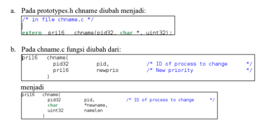
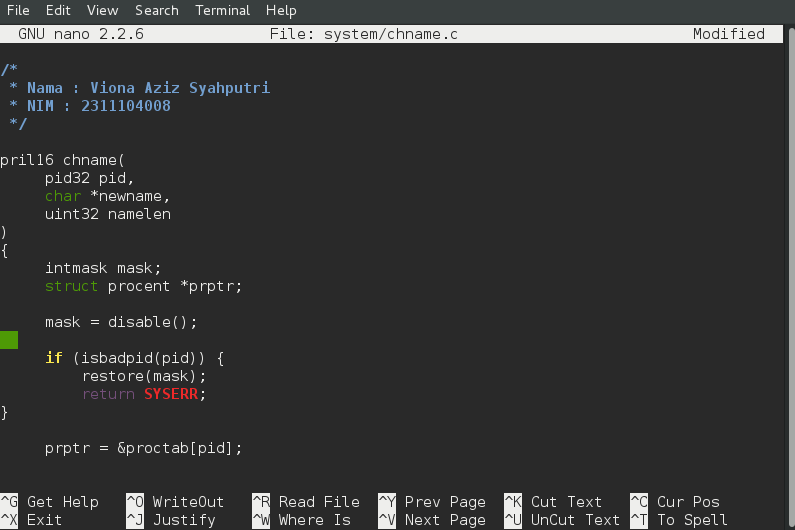
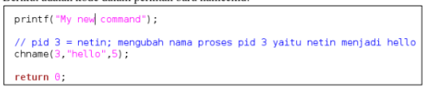
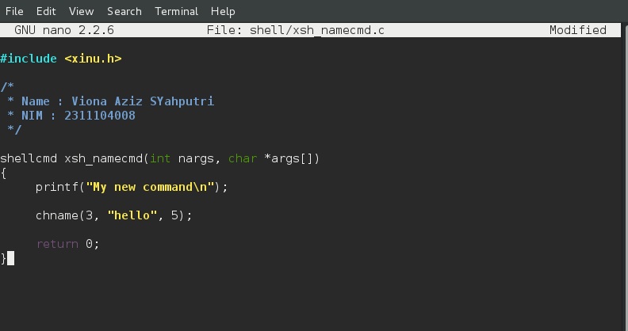
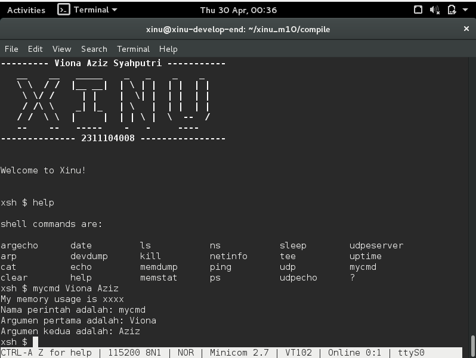

# <h1 align="center">Laporan Praktikum Modul X   Shell</h1>

Viona Aziz Syahputri - 2311104008

## Dasar Teori
Shell merupakan sebuah program yang berfungsi untuk penghubung antara pengguna dengan sistem operasi. Shell menerima perintah dari pengguna dalam bentuk command, kemudian menerjemahkannya agar dapat dieksekusi oleh kernel melalui system call. Dengan adanya shell, pengguna dapat berinteraksi dengan sistem operasi tanpa harus berhubungan langsung dengan kernel.

Pada sistem operasi Xinu, shell bekerja dengan cara membaca input dari user secara terus-menerus, memecah input menjadi command beserta argumennya, lalu mencocokkannya dengan daftar command yang tersedia pada command table (cmdtab). Jika command ditemukan, maka shell akan memanggil fungsi yang sesuai.

Dalam modul ini dilakukan modifikasi shell dengan menambahkan command baru bernama namecmd serta memodifikasi syscall chname. Syscall chname digunakan untuk mengubah nama suatu proses pada tabel proses (proctab). Dengan modifikasi ini, shell dapat menjalankan command yang memanggil syscall tersebut sehingga nama proses dapat berubah saat sistem berjalan.

## Guided
1. [40 Poin] Akan dimodifikasi shell dengan modifikasi syscall bernama chname yang
berfungsi untuk mengubah nama suatu proses. Lihat kembali modul sebelumnya cara
membuat syscall.
Perhatikan sekarang syscall chname mempunyai 3 parameter yaitu pid, character dan
panjang character. Character untuk menyimpan nama dan panjang character untuk
panjang nama.

Modifikasi kode pada chname.c sehingga nama proses bisa diubah bila syscall tersebut
dipanggil.

2. [40 Poin] Buatlah perintah baru bernama namecmd sesuai dengan langkah-langkah pada
no.5 pada modul shell!
Berikut adalah kode dalam perintah baru namecmd:

    

3. [20 Poin] Test hasilnya:  
    a. Masuk ke terminal xinu  
    b. Jalankan perintah ps 
    c. Jalankan perintah namecmd  
    d. Jalankan perintah ps 
    e. Lihat nama proses telah berubah

## Referensi
1. [https://telkomuniversityofficial-my.sharepoint.com/shared?listurl=https%3A%2F%2Ftelkomuniversityofficial-my.sharepoint.com%2Fpersonal%2Fmaghaz_student_telkomuniversity_ac_id%2FDocuments&id=%2Fpersonal%2Fmaghaz_student_telkomuniversity_ac_id%2FDocuments%2F2026%2F00.+Modul+Praktikum+Sistem+Operasi+SE+2526-2.pdf&parent=%2Fpersonal%2Fmaghaz_student_telkomuniversity_ac_id%2FDocuments%2F2026&shareLink=1&ga=1](https://telkomuniversityofficial-my.sharepoint.com/shared?listurl=https%3A%2F%2Ftelkomuniversityofficial-my.sharepoint.com%2Fpersonal%2Fmaghaz_student_telkomuniversity_ac_id%2FDocuments&id=%2Fpersonal%2Fmaghaz_student_telkomuniversity_ac_id%2FDocuments%2F2026%2F00.+Modul+Praktikum+Sistem+Operasi+SE+2526-2.pdf&parent=%2Fpersonal%2Fmaghaz_student_telkomuniversity_ac_id%2FDocuments%2F2026&shareLink=1&ga=1)