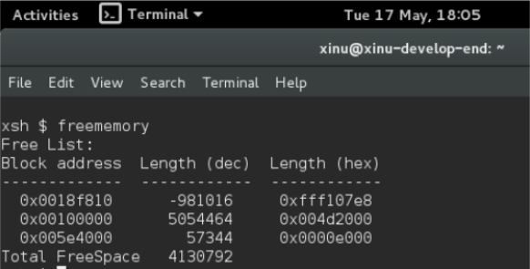
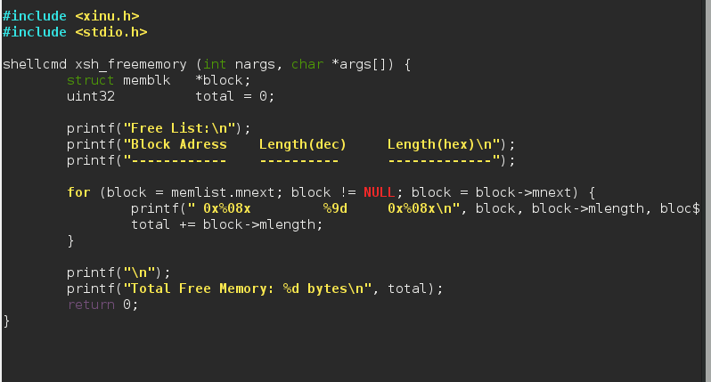
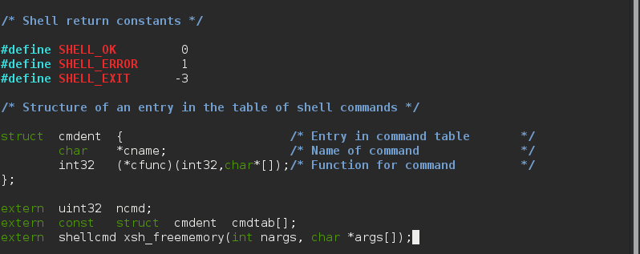
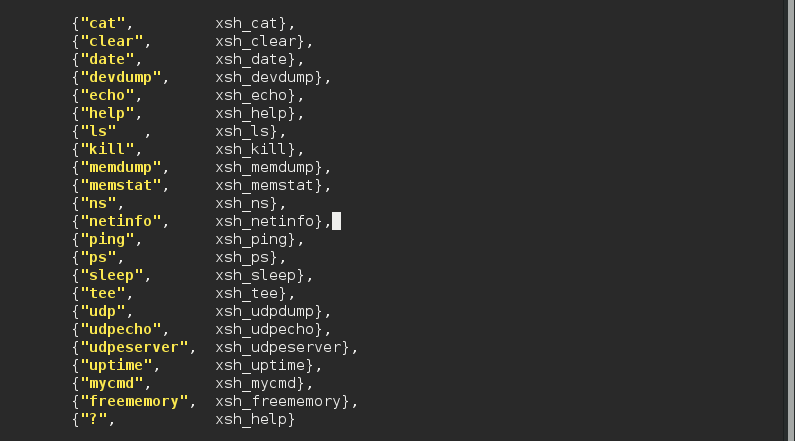
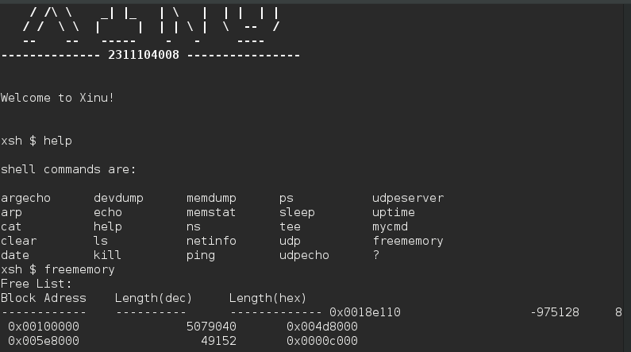

# <h1 align="center">Laporan Praktikum Modul XI   Memori Xinu</h1>

Viona Aziz Syahputri - 2311104008

## Dasar Teori
Pada sistem operasi, memori merupakan bagian penting yang digunakan untuk menyimpan data dan menjalankan proses. Xinu memiliki mekanisme manajemen memori yang mengatur bagaimana memori dialokasikan dan dibebaskan selama sistem berjalan. Salah satu metode yang digunakan yaitu menggunakan free list untuk menyimpan daftar blok memori yang masih kosong.

Free memory adalah bagian memori yang belum digunakan oleh proses sehingga masih tersedia untuk dialokasikan. Ketika proses meminta memori, sistem akan mengambil blok dari free list. Jika memori sudah tidak dipakai maka blok tersebut akan dikembalikan lagi ke free list agar bisa digunakan kembali.

Xinu menggunakan struktur linked list dalam pengelolaan free memory karena lebih fleksibel untuk menambah, menghapus, dan menggabungkan block memori kosong. Setiap block memori memiliki informasi alamat block berikutnya dan ukuran block tersebut.

Dalam manajemen memori terdapat proses alokasi dan dealokasi. Alokasi adalah proses pemberian memori kepada program, sedangkan dealokasi adalah proses mengembalikan memori yang sudah tidak digunakan. Jika pengelolaan memori tidak dilakukan dengan baik maka dapat terjadi fragmentasi memori yaitu kondisi ketika memori kosong terpecah menjadi bagian kecil sehingga sulit digunakan kembali.

Heap merupakan area memori yang digunakan untuk alokasi dinamis. Penggunaan heap lebih rawan menimbulkan masalah seperti memory leak dan fragmentasi karena pengelolaannya dilakukan secara manual oleh program. Oleh karena itu diperlukan pengelolaan memori yang baik agar sistem tetap stabil dan efisien.

## Guided
1. [80 poin] Buatlah perintah baru bernama freememory yang memiliki dua fungsi berikut:  
**a. [40 poin] Menampilkan seluruh free memory block yang tercatat dalam free memory list pada Xinu.  **
**b. [40 poin] Menghitung dan menampilkan total ukuran free memory berdasarkan 
seluruh block yang ada pada list tersebut.  **
Output yang diinginkan: 

2. [4 poin per subsoal] Jawablah pertanyaan berikut:  
**a. Mengapa Xinu memisahkan data segment dan BSS segment?  **
Karena biar pengelolaan memorinya lebih rapi dan juga efisien.
Data segment dipakai buat nyimpen variabel yang sudah punya nilai awal, sedangkan BSS buat variabel yang belum punya nilai atau masih 0. Jadi ukuran program bisa lebih kecil dan memori juga lebih hemat. 
**b. Bagaimana alokasi dan dealokasi memori selama eksekusi memengaruhi ukuran free space?  **
Kalau program melakukan alokasi memori maka free space bakal berkurang karena memorinya dipakai proses. Terus kalau memorinya dibebaskan lagi atau didealokasi maka free space bakal bertambah lagi. Kalau terlalu sering alokasi dan dealokasi juga bisa bikin memori terpecah-pecah.  
**c. Mengapa penggunaan heap lebih berpotensi menimbulkan masalah dibandingkan
stack?  ** 
Karena heap diatur manual sama program jadi lebih rawan error.
Kalau lupa membebaskan memori bisa terjadi memory leak. Selain itu heap juga bisa mengalami fragmentasi. Sedangkan stack lebih aman karena pengaturannya otomatis dan urut. 
**d. Mengapa Xinu menggunakan struktur linked list untuk menyimpan free block?  **
Karena linked list lebih gampang dipakai buat nyimpen dan mengatur block memori kosong.
Kalau ada block baru atau block yang dihapus bisa langsung disambung tanpa harus geser data lain. Jadi pengelolaan free memory lebih fleksibel. 
**e. Apa tantangan utama dalam penggunaan heap di Xinu?  **
Tantangan utamanya yaitu fragmentasi memori.
Jadi memori kosong bisa terpecah jadi bagian kecil-kecil sehingga susah dipakai lagi buat alokasi besar. Selain itu kalau salah ngatur heap juga bisa bikin memory leak atau sistem error.

## Referensi
1. [https://telkomuniversityofficial-my.sharepoint.com/shared?listurl=https%3A%2F%2Ftelkomuniversityofficial-my.sharepoint.com%2Fpersonal%2Fmaghaz_student_telkomuniversity_ac_id%2FDocuments&id=%2Fpersonal%2Fmaghaz_student_telkomuniversity_ac_id%2FDocuments%2F2026%2F00.+Modul+Praktikum+Sistem+Operasi+SE+2526-2.pdf&parent=%2Fpersonal%2Fmaghaz_student_telkomuniversity_ac_id%2FDocuments%2F2026&shareLink=1&ga=1](https://telkomuniversityofficial-my.sharepoint.com/shared?listurl=https%3A%2F%2Ftelkomuniversityofficial-my.sharepoint.com%2Fpersonal%2Fmaghaz_student_telkomuniversity_ac_id%2FDocuments&id=%2Fpersonal%2Fmaghaz_student_telkomuniversity_ac_id%2FDocuments%2F2026%2F00.+Modul+Praktikum+Sistem+Operasi+SE+2526-2.pdf&parent=%2Fpersonal%2Fmaghaz_student_telkomuniversity_ac_id%2FDocuments%2F2026&shareLink=1&ga=1)