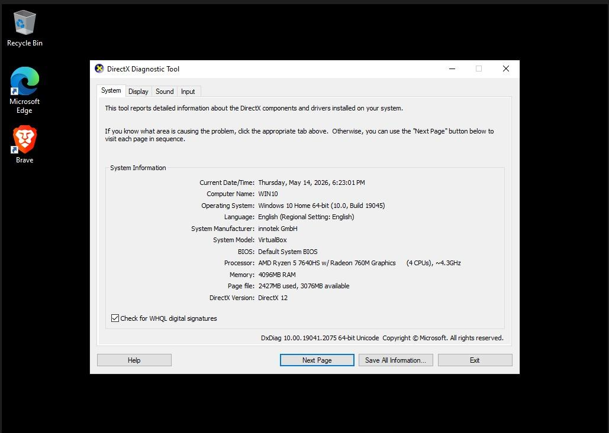
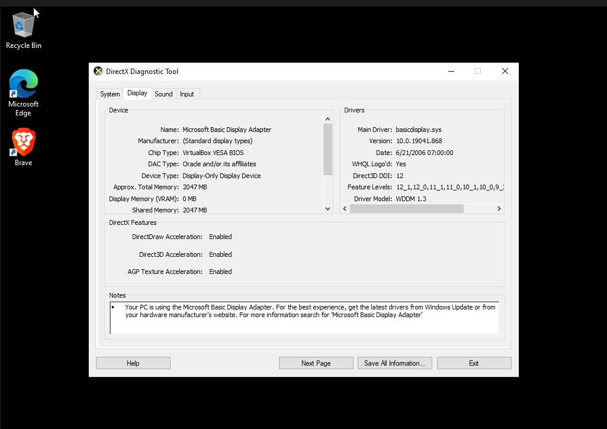
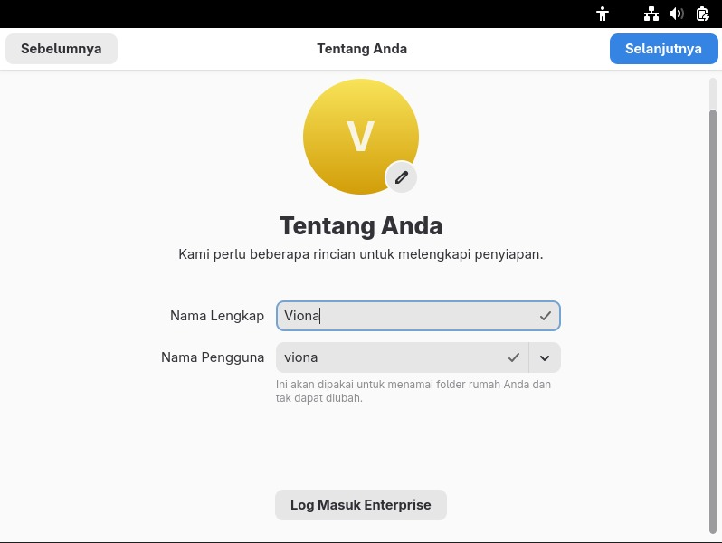
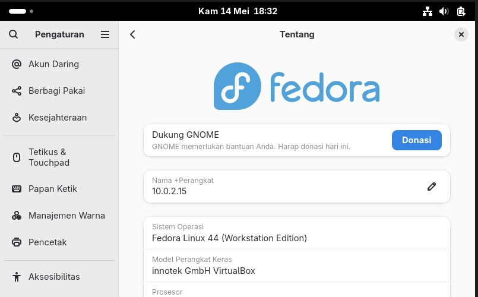

# <h1 align="center">Laporan Praktikum Modul XII <br> Linux dan Windows</h1>
<p align="center">Viona Aziz Syahputri - 2311104008</p>

## Dasar Teori
Sistem operasi adalah perangkat lunak yang berfungsi untuk mengatur seluruh aktivitas komputer supaya perangkat keras dan perangkat lunak bisa berjalan dengan baik. Jadi nih, sistem operasi itu jadi penghubung antara pengguna dengan komputer. Tanpa sistem operasi, komputer tidak bisa digunakan secara normal karena semua proses seperti membuka aplikasi, mengatur file, sampai menjalankan perangkat keras dilakukan oleh sistem operasi.

Pada modul ini membahas dua sistem operasi yang paling sering digunakan yaitu Windows dan Linux. Windows merupakan sistem operasi buatan Microsoft yang terkenal karena tampilannya mudah dipahami dan cocok digunakan untuk kebutuhan sehari-hari seperti mengetik, bermain game, dan menjalankan aplikasi perkantoran. Windows juga memiliki banyak versi mulai dari Windows 1.0 sampai Windows 10 dan versi terbaru lainnya.

Sedangkan Linux adalah sistem operasi open source yang dapat digunakan dan dikembangkan secara bebas. Linux terkenal lebih ringan, stabil, dan aman. Banyak server maupun programmer menggunakan Linux karena fleksibel dan tidak membutuhkan spesifikasi terlalu tinggi. Salah satu distribusi Linux yang populer adalah Ubuntu karena tampilannya cukup mudah dipahami untuk pemula.

## Guided
**1.  [10 Poin] Jelaskan dengan bahasa sendiri, apa itu Sistem Operasi? <br>**
Sistem operasi adalah software utama yang ada di komputer untuk mengatur semua proses yang berjalan di dalam perangkat. Jadi nih, sistem operasi itu seperti penghubung antara pengguna dengan hardware komputer. Semua aktivitas seperti membuka aplikasi, menyimpan file, menjalankan program, sampai mengatur memori dilakukan oleh sistem operasi. Tanpa sistem operasi, komputer tidak bisa digunakan dengan normal karena hardware dan software tidak dapat bekerja sendiri.

**2. [25 Poin] Buka dxdiag pada kolom search windows, dan jawab pertanyaan berikut! <br>
[5 Poin] Sertakan Screenshot!<br>**


**a. [5 Poin] Windows apakah yang diinstal? <br>**
Windows yang terinstal pada komputer saya adalah Windows 10.<br>
**b. [5 Poin] Berapa bit Windows yang diinstall? <br>** 
Windows yang digunakan adalah 64-bit. <br>
**c. [5 Poin] Berapa kecepatan processor yang digunakan? <br>**
Processor yang digunakan adalah AMD Ryzen 5 7640HS dengan kecepatan sekitar 4.3 GHz dan memiliki 4 CPU. <br>
**d. [5 Poin] Grafik yang digunakan versi berapa? Apakah sudah sesuai dengan spesifikasi rekomendasi pada modul?<br>**
Grafik yang digunakan sudah mendukung DirectX 12 dengan driver model WDDM 1.3. Menurut saya spesifikasi grafik tersebut sudah sesuai bahkan lebih tinggi dibanding spesifikasi minimum pada modul yang hanya membutuhkan DirectX 9.

**3. [10 Poin] Apa kelebihan dari windows yang terpasang sekarang? Sebutkan versi berapa windows terbaru saat ini! <br>**
Menurut saya Windows yang digunakan sekarang memiliki tampilan yang lebih modern dan mudah dipahami. Selain itu, Windows juga mendukung banyak aplikasi sehingga lebih nyaman dipakai untuk tugas kuliah, browsing, editing, maupun gaming. Jadi nih, hampir semua software bisa berjalan dengan baik di Windows sehingga pengguna tidak terlalu kesulitan. <br>

Versi Windows terbaru saat ini adalah Windows 11.

**4. [25 Poin] Buka virtualbox, dan jawab pertanyaan berikut! 
[5 Poin] Sertakan Screenshot! <br>**


**a. [5 Poin] Linux apakah yang diinstall? <br>**
Linux yang diinstall adalah Ubuntu.<br>
**b. [5 Poin] Berapa bit Linux yang diinstall?<br>**
Linux yang digunakan adalah 64-bit.<br>
**c. [5 Poin] Berapa ukuran hard disk virtual mesin? <br>**
Ukuran hard disk virtual mesin adalah 25 GB.<br>
**d. [5 Poin] Terdapat berapa buah partisi pada hard disk? <br>**
```
Terdapat 3 partisi pada hard disk, yaitu:
1. EFI System Partition
2. Boot Partition
3. Root Partition
```

**5. [10 Poin] Linux memiliki berbagai jenis, sebutkan 5 jenis linux distro! <br>**

    1. Ubuntu
    2. Debian
    3. Fedora
    4. Kali Linux
    5. Linux Mint

**6. [10 Poin] Anda sudah mengenal dan menggunakan 3 jenis sistem operasi pada praktikum ini, sebutkan sistem operasi tersebut! <br>**

    1. Windows
    2. Ubuntu
    3. Linux


**7. [10 Poin] Setelah mengenal 3 jenis sistem operasi tersebut, menurut Anda sistem operasi mana yang lebih mudah digunakan? Jelaskan argumentasi Anda! <br>**
Menurut saya sistem operasi yang paling mudah digunakan adalah Windows. Jadi nih, tampilannya lebih sederhana dan mudah dipahami bahkan untuk pengguna baru. Selain itu hampir semua aplikasi yang dibutuhkan sehari-hari tersedia di Windows. Driver perangkat juga lebih mudah dipasang sehingga pengguna tidak terlalu kesulitan saat menggunakan komputer. Walaupun Linux lebih ringan dan aman, tetapi masih perlu penyesuaian terutama untuk pengguna yang belum terbiasa menggunakan terminal atau command line.


## Referensi
1. [https://telkomuniversityofficial-my.sharepoint.com/shared?listurl=https%3A%2F%2Ftelkomuniversityofficial-my.sharepoint.com%2Fpersonal%2Fmaghaz_student_telkomuniversity_ac_id%2FDocuments&id=%2Fpersonal%2Fmaghaz_student_telkomuniversity_ac_id%2FDocuments%2F2026%2F00.+Modul+Praktikum+Sistem+Operasi+SE+2526-2.pdf&parent=%2Fpersonal%2Fmaghaz_student_telkomuniversity_ac_id%2FDocuments%2F2026&shareLink=1&ga=1](https://telkomuniversityofficial-my.sharepoint.com/shared?listurl=https%3A%2F%2Ftelkomuniversityofficial-my.sharepoint.com%2Fpersonal%2Fmaghaz_student_telkomuniversity_ac_id%2FDocuments&id=%2Fpersonal%2Fmaghaz_student_telkomuniversity_ac_id%2FDocuments%2F2026%2F00.+Modul+Praktikum+Sistem+Operasi+SE+2526-2.pdf&parent=%2Fpersonal%2Fmaghaz_student_telkomuniversity_ac_id%2FDocuments%2F2026&shareLink=1&ga=1)